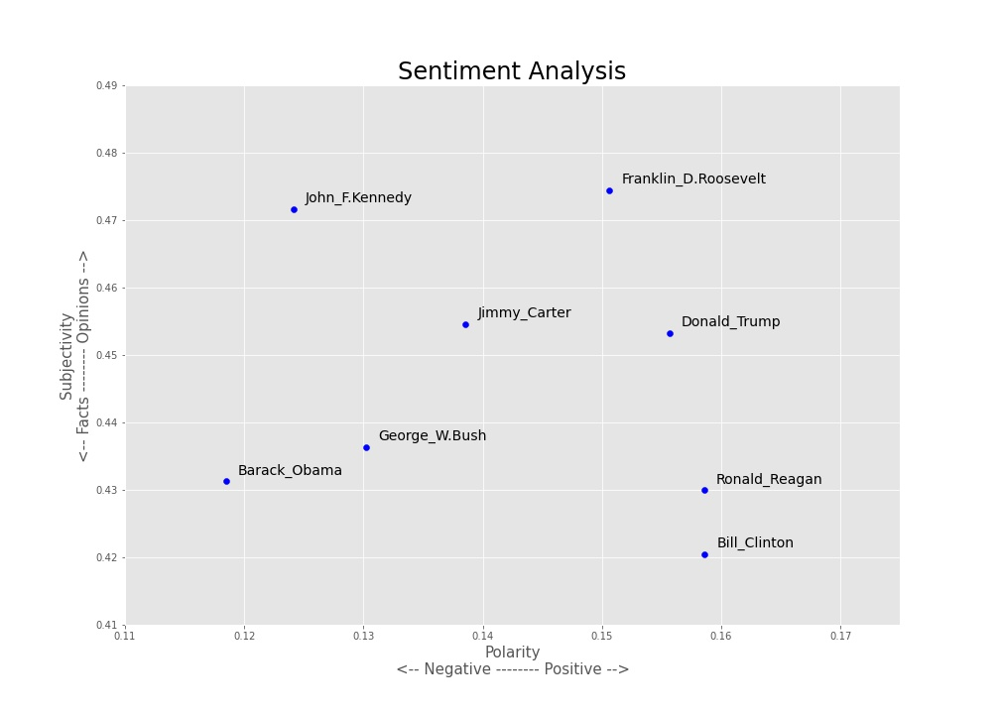
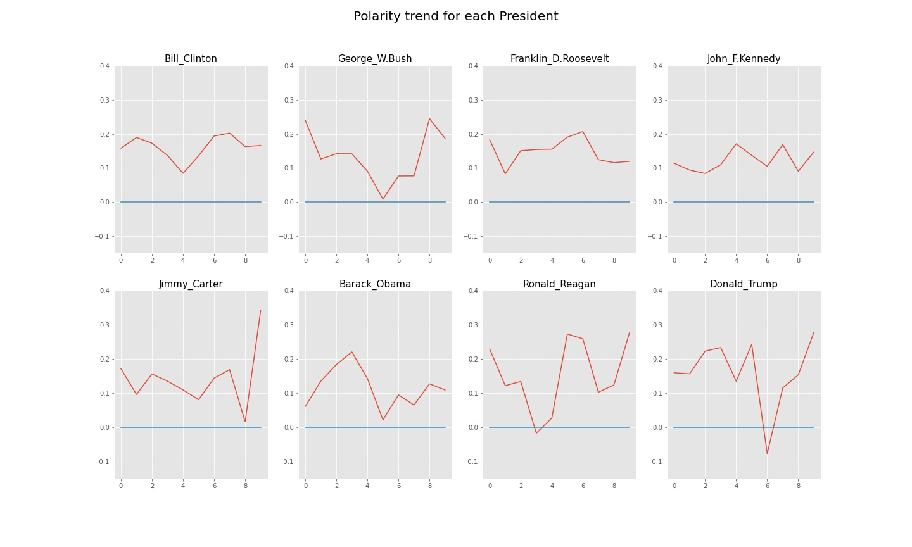

# Sentiment Analysis

Sentiment Analysis on US Presidential Speeches of State of the Union Address using NLP

Author: **Praveen Mohan**

---

## Introduction
* *This project utilizes the abilities of Natural Language Processing (NLP) in building Unsupervised Sentiment Analysis model for analyzing the transcripts of some of the most popular US Presidential speeches in the history.*
* *In simple words NLP is a technique which is used to mine the raw text or transcript data to gather valuable information or to make sense out of the raw data. This project will help us understand how each president’s speech had an impact in the elections and among the people and also help us identify patterns, similarities and differences within each president’s speeches.*
* *The Sentiment Analysis is a technique that analyses the emotions involved in a transcript. It helps us identify the kinds of common emotions that each president uses and also helps us to understand the impact of various emotions among people.*

---

## Data Source: [The Miller Center](https://millercenter.org/the-presidency/presidential-speeches)
- It is a nonpartisan affiliate of the University of Virginia which specializes in presidential speeches, policies and political history.
- They apply the lessons of history to the nation’s most pressing contemporary governance challenges.

---

## Packages Required
- `import requests` to scrape from the URL.
- `from bs4 import BeautifulSoup` to convert to a text form from the URL.
- `import pickle` to store the scraped text in required format.
- `import pandas as pd` to store the transcripts in a dataframe.
- `import numpy as np` mostly to use `np.arange()` function.
- `import re` for cleanning the raw text.
- `import strings` for performing common string operations.
- `from sklearn.feature_extraction.text import CountVectorizer` to create a Document-Term Matrix.
- `import nltk` importing the Natural Language Tool Kit package.
- `from nltk.corpus import wordnet as wn` WordNet is a lexical database for the English language, which was created by Princeton, and is part of the NLTK corpus.
- `from nltk.stem.wordnet import WordNetLemmatizer` to perform Stemming and Lemmatization on the raw text.
- `from nltk import word_tokenize, pos_tag` to tokenize the transcripts.
- `from collections import defaultdict` to compare each lemma with the default dictionary to get the correct spelling for the stemmed words.
- `from wordcloud import WordCloud` to visualize the most frequent words in the form of a Word Cloud.
- `import matplotlib.pyplot as plt` to plot bar and scatter plots.
- `import seaborn as sns` to use `sns.set()` function to make plots more interesting.
- `from textblob import TextBlob` to perform the Sentiment Analysis.

**The following content needs to be downloaded from the `nltk`:**
* `nltk.download('stopwords')`
* `nltk.download('wordnet')`
* `nltk.download('averaged_perceptron_tagger')`

---

## Data Gathering 

### Web Scrapping 
* **`requests`**
* **`BeautifulSoup`**

---

## Data Cleaning -  Text Pre-processing  

### Minimum Viable Product (MVP) Approach

**Data Cleaning steps on all texts:**
* Make text all lower case
* Remove punctuation
* Remove numerical values
* Remove common non-sensical text
* Tokenize text
* Remove stop words

**Data Cleaning steps after Tokenization:**
* Stemming / lemmatization
* Parts of speech tagging
* Create bi-grams or tri-grams or n-grams
* Deal with typos
* And more...

---

## Exploratory Data Analysis

## `wordcloud`

**A tag cloud (word cloud or wordle or weighted list in visual design) is a novelty visual representation of text data, typically used to depict keyword metadata (tags) on websites, or to visualize free form text. Tags are usually single words, and the importance of each tag is shown with font size and color.**

---

## Sentiment Analysis

1. **TextBlob Module:** Linguistic researchers have labeled the sentiment of words based on their domain expertise. Sentiment of words can vary based on where it is in a sentence. The TextBlob module allows us to take advantage of these labels.
2. **Sentiment Labels:** Each word in a corpus is labeled in terms of polarity and subjectivity (there are more labels as well). A corpus' sentiment is the average of these.
   * **Polarity**: How positive or negative a word is. -1 is very negative. +1 is very positive.
   * **Subjectivity**: How subjective, or objective (opinionated) a word is. 0 is fact. +1 is very much an opinion.

For more info on TextBlob [sentiment function](https://planspace.org/20150607-textblob_sentiment/).

## Sentiment of Speeches Over Time

* *The above results gives us the sentiment analysis of speech as a whole.*
* *The below analysis is about the sentiment over time throughout each speeches for each President.*

### Polarity trend for each President throughout their speeches.

### Subjectivity trend for each President throughout their speeches.

---

